# mainAxisAlignment 와 CrossAxisAlignment
- axis는 중심선이란 뜻이다. corssaxis: 횡축, mainaxis: 주축
- row 의 경우    =>     주축: 가로,     횡축 : 세로
- column 의 경우 =>     주축: 세로,     횡축 : 가로

## MainAxisAlignment 예시
- MainAxisAlignment.center
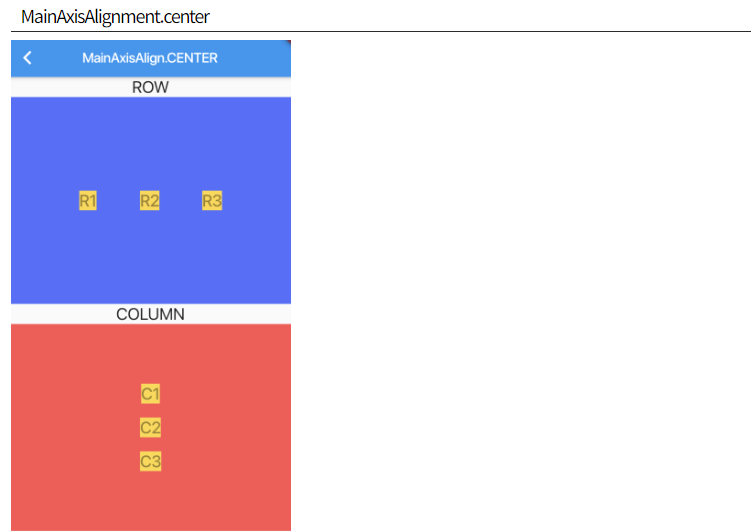

- MainAxisAlignment.start
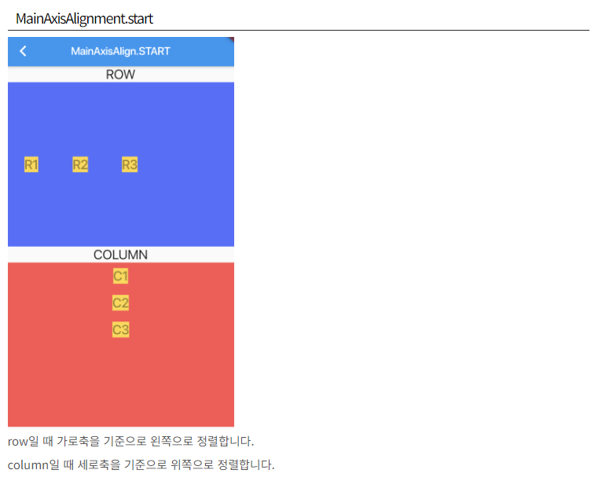

- MainAxisAlignment.end
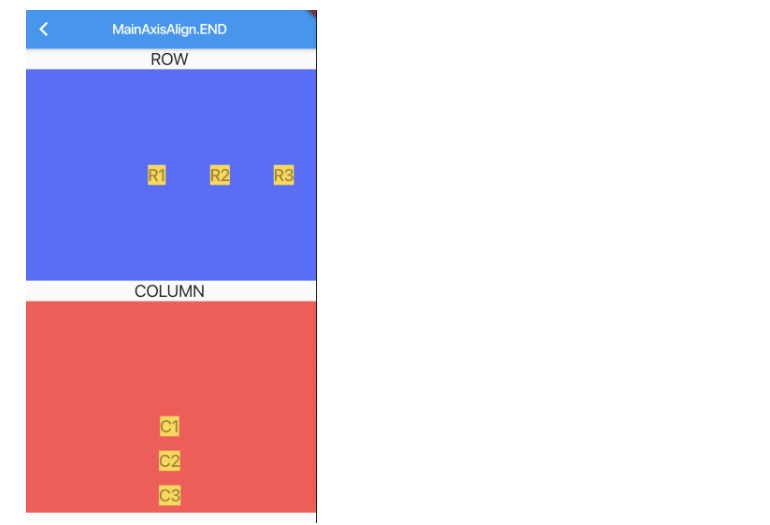

- MainAxisAlignment.spaceEvently
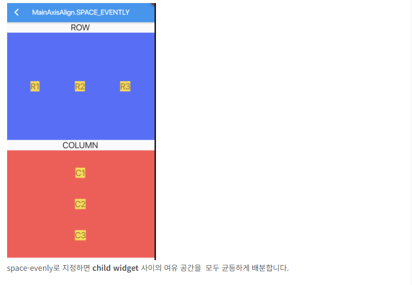

- MainAxisAlignment.spaceBetween
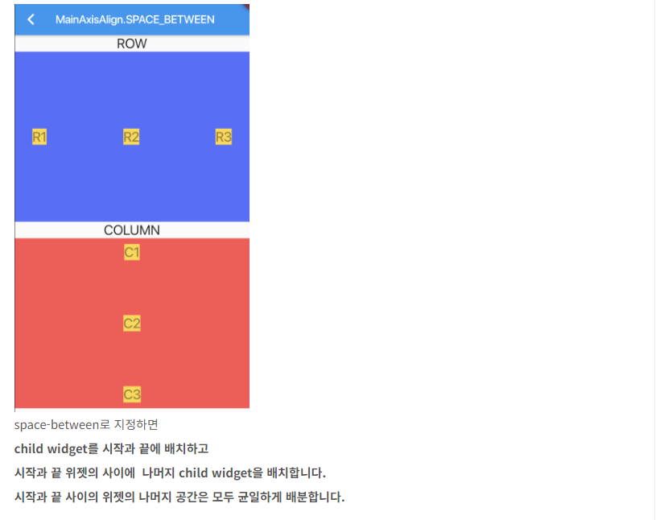

- MainAxisAlignment.spaceAround
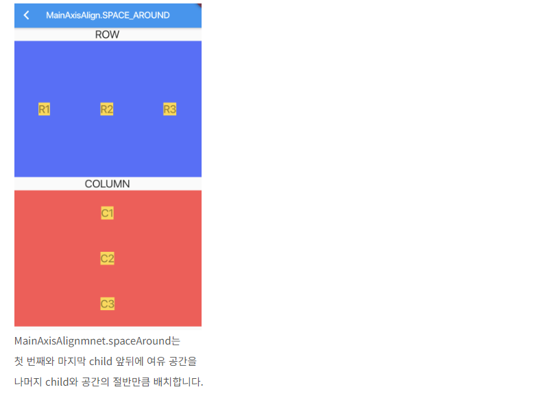

- between,arround, evently 차이
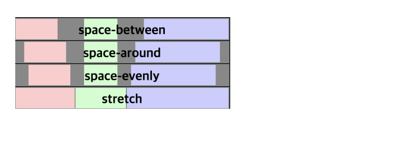

- CrossAxisAlignment.center
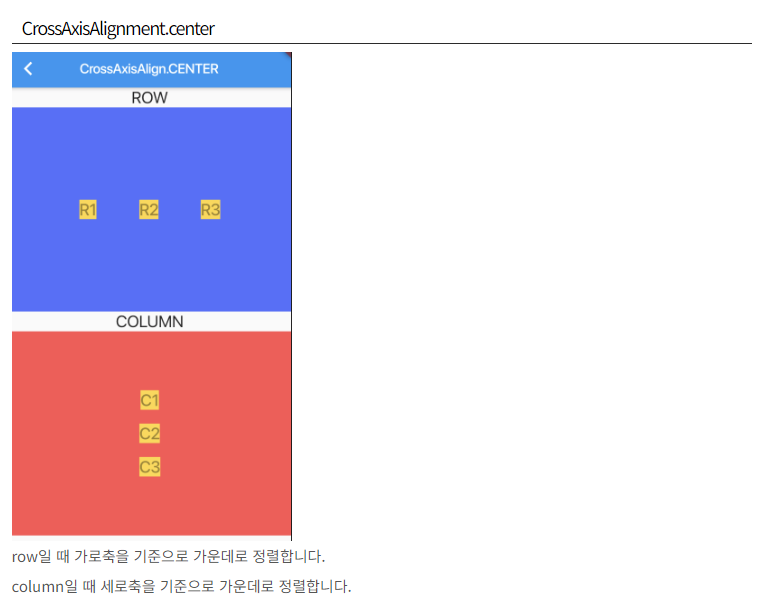

- CrossAxisAlignment.start
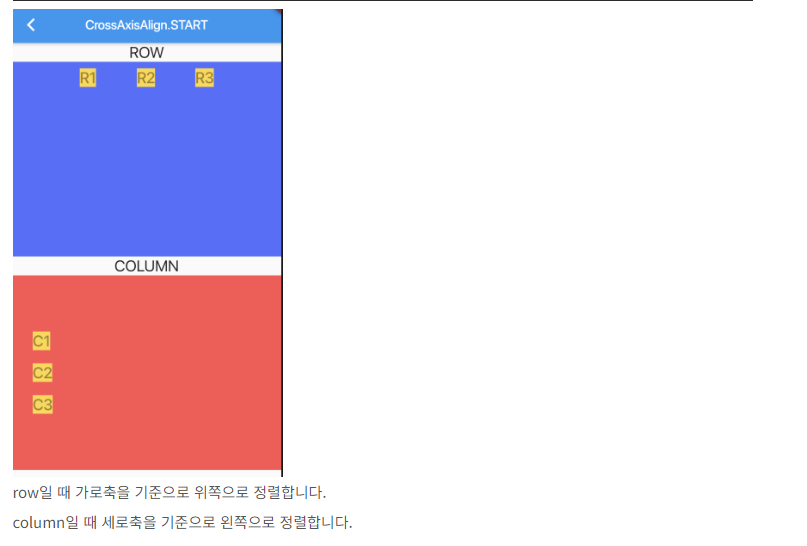

- CrossAxisAlignment.end
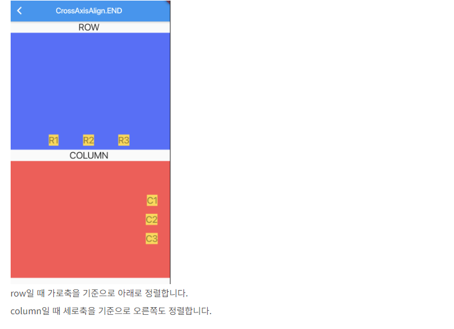

- CrossAxisAlignment.stretch
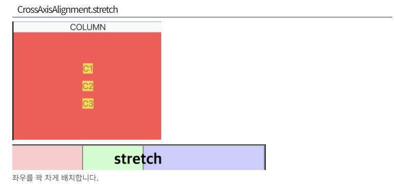

- CrossAxisAlignment.baseline
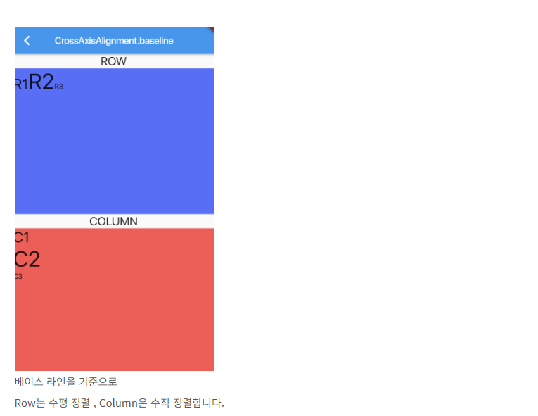
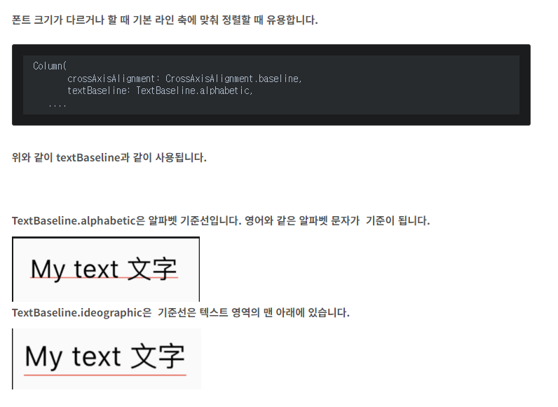